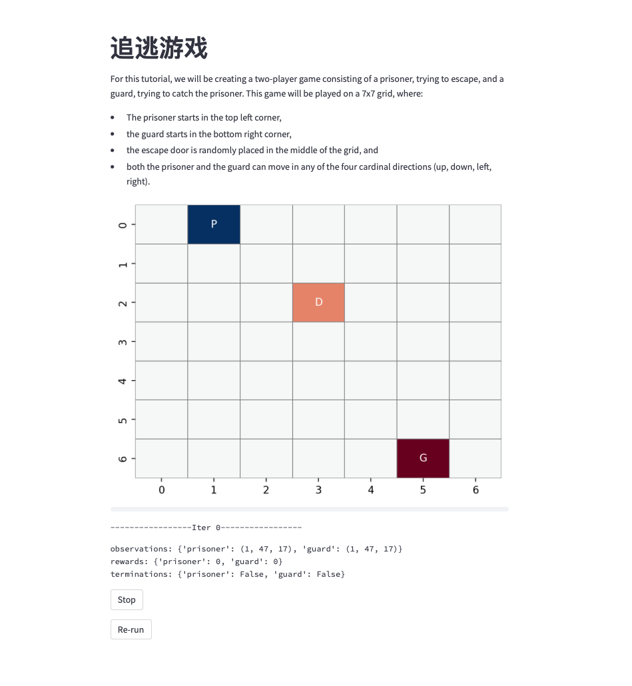

# Multi-agent Environment toys

## Guard Prisoner
`guard_prisoner/`

Code for re-implementation of the [PettingZoo tutorial](https://pettingzoo.farama.org/tutorials/environmentcreation/2-environment-logic/).
Changes include:
1. With some bug fixed. 
2. Environment tested using random policy.
3. Enable visualization based on [Streamlit](https://docs.streamlit.io).



To launch the visualization (random policy), 
```shell
streamlit run guard_prisoner/test_env.py
```